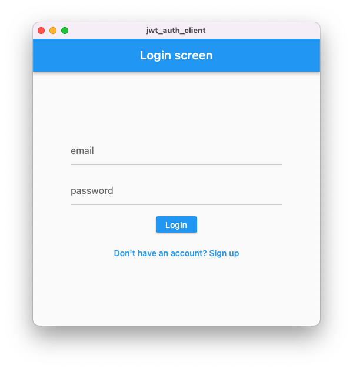
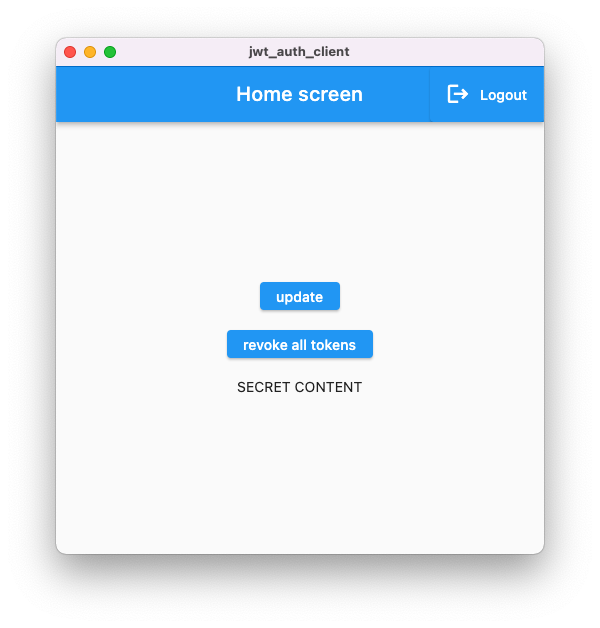

# JWTAuthClient

Example project where authentication is implemented through JWT access tokens along with refresh tokens.  

## JWTAuthService

This application uses the [JWTAuthService](https://github.com/BeFunny1/JWT_Auth-Serivce) API by [@BeFunny1](https://github.com/BeFunny1).  
Service can be run locally if docker is installed.

1. create `.env` file (copy of `.env.example`) and come up with keys
2. run `make`

## Startup client steps  

1. Create a `config.json` file in the `/assets` folder (create a copy of the `config_example.json` and enter the required data);
2. Install dependencies: `flutter pub get`
3. Start file generation `flutter pub run build_runner build --delete-conflicting-outputs`
4. Run the project `flutter run`

